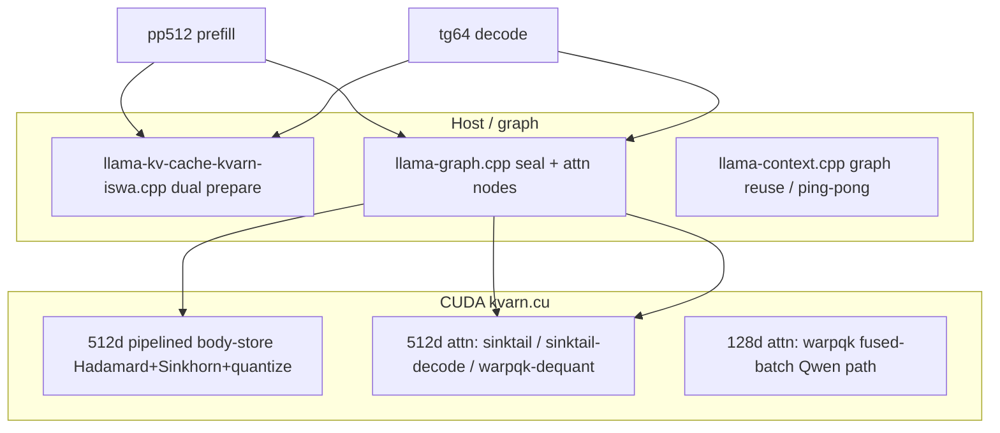

# KVarN CUDA — Code Review Agent Handover

**Audience:** New agent performing **read-only / patch** architecture review (no local GPU, no model files, no benchmark execution).  
**Mission:** Exhaustively review the codebase, identify root causes of Gemma true KVarN+ISWA throughput gap vs normal KV, **implement fixes**, and leave the branch ready for a human or CI agent to run gates.  
**Branch:** `kvarn-atx-integration`  
**HEAD:** [`95390d5b1`](https://github.com/JakeATX/llama.cpp/commit/95390d5b1)  
**Review tree:** [github.com/JakeATX/llama.cpp/tree/kvarn-atx-integration](https://github.com/JakeATX/llama.cpp/tree/kvarn-atx-integration)

---

## Your constraints (read first)

- You **cannot** run `llama-bench`, CUDA builds, or download GGUF models. Do **not** claim gate PASS/FAIL from estimates alone.
- You **can** read all source, apply focused patches, and reason from static structure + documented bench artifacts.
- After code changes: run **only** what compiles in-editor (lints); a separate environment runs `ctest` and `run_bench_matrix.ps1`.
- **Do not** flip Gemma production policy in `src/llama-model.cpp` until documented gates pass (see §Production guardrails).
- **Do not** commit Nex/unrelated scripts under `scripts/nex_*`, `runs/nex_*`, `docs/nex-*`.

---

## Success definition (decode + prefill equivalence)

Production gate for **Gemma experimental true KVarN+ISWA** (`LLAMA_KVARN_FORCE_EXPERIMENTAL_ISWA=1`):

| Case | Config | Body records in stderr | Target ratio | Target KVarN abs (RTX 5070 ref) |
|------|--------|------------------------|-------------:|--------------------------------:|
| **pp512** | `-fa off -ngl 99 --kvarn-iters 4 --kvarn-rtn-quantile 1.0` | **2** on layers `5-47:6` | **≥ 90%** | ~2180+ t/s when normal ~2420 |
| **tg64** | same | **0** | **≥ 90%** | ~56+ t/s when normal ~62 |

Also required before policy flip:

- Qwen3.6 MTP true KVarN regression ≥ 90% on pp512 + tg64 (`-ncmoe 34`) — must not regress.
- `ctest -R "test-kvarn-kv|test-kvarn-cuda|test-batch-split"` + Tier2 logits NMSE.

**Qwen already passes** at head_dim 128. **Gemma** at head_dim 512 is the open problem.

---

## Measured state after `95390d5b1` (human-run benches)

Artifact: `artifacts/kvarn-bench/gemma-architect-rerun/summary.csv`  
Model: `gemma-4-12b-it-UD-Q4_K_XL.gguf`, experimental ISWA, r=5.

| Case | Normal t/s | KVarN t/s | Ratio | Gap to 90% gate |
|------|----------:|----------:|------:|----------------|
| pp512 | 2414.73 | 1564.67 | **64.8%** | ~+610 KVarN t/s |
| tg64 | 61.91 | 44.37 | **71.7%** | ~+12 KVarN t/s |

Earlier run before K-layout fix (`gemma-batch-store-p1`): pp512 **70.8%** (1872 t/s), tg64 **73.7%** (48.9 t/s).  
**P0 K-layout fix was correctness-necessary** but pp512 KVarN absolute dropped ~1872→1565 — investigate whether warpqk body-dequant path is now correct but structurally slow.

Tier2 logits: **PASS** on Qwen2.5-1.5B and Gemma Q4_XL after `95390d5b1` (repeat/split/scratch).

---

## Architecture map (where time goes)



### Memory paths

| Path | File | Models |
|------|------|--------|
| Hybrid KVarN | `src/llama-memory-hybrid-kvarn.cpp` | Qwen3.6 MTP |
| KVarN+ISWA | `src/llama-kv-cache-kvarn-iswa.cpp` | Gemma 4 |
| Standalone KVarN | `src/llama-kv-cache-kvarn.cpp` | tests / smaller |
| Policy | `src/llama-model.cpp` ~2073–2242 | Gemma → normal ISWA fallback by default |

### CUDA dispatch (`ggml/src/ggml-cuda/kvarn.cu` → `ggml_cuda_kvarn_attn_mixed_f16`)

| Condition | Kernel / mode | Trace label |
|-----------|---------------|-------------|
| `head_dim>=512 && n_records==0 && n_pending==0 && n_queries==1` | `sinktail-decode` | `sinktail-decode` |
| `head_dim>=512 && n_records==0 && n_pending==0` | `sinktail-f16` batch | `sinktail-f16` |
| `head_dim>=512 && n_records>0` | pre-dequant + `warpqk-f16` | `warpqk-f16-dequant` |
| `head_dim>=512` else | `warpqk-f16` | `warpqk-f16` |
| `head_dim<512` | fused-batch / warpqk | `warpqk-f16` etc. |

### Body-store dispatch

| Op | When | File hooks |
|----|------|------------|
| Single-head tile | default | `ggml_kvarn_store_kv_body` |
| All-head pending | `head_dim>=512 && n_head_kv>1` | `ggml_kvarn_store_kv_body_pending_heads` |
| Multi-record pending | `head_dim>=512 && n_head_kv==1 && seal_records.size()>1` | `ggml_kvarn_store_kv_body_pending_records` |
| 512d pipelined | `head_dim>=512` in CUDA | `ggml_cuda_kvarn_store_kv_body_512_pipelined` (event-ordered aux stream) |

**Gemma fact:** KVarN layers log **`n_head_kv=1`**. Multi-head batching does not apply. Record batching only fires when `kvarn_graph_seal_records()` returns **>1 record in one ubatch** (`src/llama-graph.cpp` ~625–645).

---

## Known shortcomings & review hypotheses (prioritize fixes)

### A. pp512 — body-store + body-active attention (primary)

1. **Per-layer seal cost** — 8 KVarN layers × Hadamard + 4× Sinkhorn + quantize per seal wave. Even pipelined K/V, still many launches per layer.
2. **Multi-record batch may not activate** — `seal_records` often **one record per ubatch** (pp512 splits 384+128); graph emits **8 store nodes/layer/rep** not batched across ubatches. **Review:** fuse seals across ubatches or batch at layer level for entire forward.
3. **warpqk-f16-dequant** — bulk `ggml_cuda_kvarn_dequant_body_n` then warpqk; K layout fixed in `95390d5b1` (record-major). **Review:** fuse dequant into warpqk loads, or token-major scratch reorder kernel once per head.
4. **KVarN prefill excluded from ping-pong** — `llama-context.cpp` ~1320–1325: `use_alt_slot` false when `kv_cache_quant_type == KVARN`. Normal KV reuses 384/128 graphs; KVarN rebuilds. **Review:** safe KVarN ping-pong with stable scratch topology (see `ab8a6db8a` decode reuse pattern).

### B. tg64 — decode path (secondary)

1. **sinktail-decode works** (trace confirms) but KVarN abs ~44 t/s vs need ~56 at 90%.
2. **ISWA dual prepare** — every ubatch calls `kv_base->prepare` + `kv_swa->prepare` (`llama-kv-cache-kvarn-iswa.cpp`). Trace via `LLAMA_KVARN_ISWA_PREPARE_TRACE=1`. **Review:** defer SWA prepare on decode-only ubatches; share slot-finding work.
3. **Graph reuse** — decode reuse fixed in `ab8a6db8a`; verify `can_reuse` for ISWA KVarN layers at 512d.

### C. Correctness landmines (do not regress)

- **K vs V body layout** in dequant vs warpqk (`kvarn_dequant_n_kernel` vs `kvarn_attn_mixed_f16_fused_batch_warpqk_kernel`). K: `d*group_size+g` per record; V: `g*head_dim+d`.
- **Aux stream ordering** in `ggml_cuda_kvarn_store_kv_body_512_pipelined` — must use events, not `cudaStreamSynchronize` on aux.
- **Anti-patterns (never default):** `LLAMA_KVARN_ATTN_SPLIT_KERNELS=1`, `LLAMA_KVARN_ATTN_SERIAL_FUSED=1`, `LLAMA_KVARN_ATTN_DECODE_PER_HEAD=1` — Gemma regresses severely.

---

## File reading order (exhaustive review)

1. `docs/GEMMA_KVARN_FAILURE_DIAGNOSTIC.md` — evidence tables  
2. `docs/KVARN_PRODUCTION_PATCH_HANDOFF.md` — landed P0 patches + specs  
3. `ggml/src/ggml-cuda/kvarn.cu` — all CUDA hot paths (~3500 lines)  
4. `ggml/src/ggml-cuda/ggml-cuda.cu` — op dispatch, trace labels, `supports_op`  
5. `src/llama-graph.cpp` — `kvarn_graph_seal_records`, body-store wiring, scratch sizing  
6. `src/llama-kv-cache-kvarn-iswa.cpp` — prepare / apply / composite context  
7. `src/llama-context.cpp` — graph reuse, ping-pong exclusion for KVarN  
8. `src/llama-model.cpp` — policy (read only; do not flip until gates pass)  
9. `scripts/kvarn/run_bench_matrix.ps1`, `run_production_gate.ps1` — gate definitions  
10. `tests/test-kvarn-kv.cpp`, `tests/test-kvarn-cuda-*.cpp` — correctness contracts  

---

## Suggested fix iteration order (code-only agent)

1. **Static audit** of `kvarn_graph_seal_records` + graph store loop — confirm when `seal_records.size()>1`; if rare, implement **cross-ubatch** or **per-layer single op** seal batching for pp512.
2. **warpqk body path** — reduce dequant + attention passes (single kernel or shared-memory tile).
3. **ISWA prepare** — conditional SWA prepare for `n_tokens==1` decode ubatches.
4. **KVarN prefill graph reuse** — extend ping-pong or single-slot reuse without scratch topology churn (mirror decode `can_reuse` stability).
5. **Sinkhorn** — only after store profiling: try `iters=2` for Gemma 512d if logits allow (bench showed marginal gain once; re-verify after other fixes).

After each substantive CUDA/graph change, note in commit message what a human should run:

```powershell
ctest --test-dir build-kvarn-cuda-static-vs -C Release -R "test-kvarn-kv|test-kvarn-cuda|test-batch-split" --output-on-failure
$env:LLAMA_KVARN_FORCE_EXPERIMENTAL_ISWA = "1"
powershell scripts\kvarn\run_bench_matrix.ps1 -Model <gemma-Q4_XL> -CaseList "pp512:512:0,tg64:0:64" ...
powershell scripts\kvarn\compare_cuda_logits_ref.ps1 -Model <gemma> -CheckPackedRepeat -CheckPackedSplit ...
```

---

## Production guardrails

- **Default Gemma** stays on **normal ISWA fallback** (`llama-model.cpp`) until experimental pp512 **and** tg64 ≥ 90% with correct body-record counts.
- Escape hatch: `LLAMA_KVARN_FORCE_NORMAL_ISWA_FALLBACK=1` (legacy), `LLAMA_KVARN_FORCE_EXPERIMENTAL_ISWA=1` (true KVarN+ISWA).
- Qwen hybrid KVarN must remain ≥ 90% after any `kvarn.cu` change affecting `head_dim<512`.

---

## Commit timeline (reviewer)

| Hash | Summary |
|------|---------|
| `f5bdd5b6c` | Gemma 512d sinktail, pipelined store, warpqk dequant, multi-head seal |
| `c6ad0c5d4` | Architect review entry in handover doc |
| `95390d5b1` | P0: K scratch layout, event-ordered store, ISWA prepare trace, multi-record seal op |

**Compare for your review:** [c6ad0c5d4..95390d5b1](https://github.com/JakeATX/llama.cpp/compare/c6ad0c5d4...95390d5b1)

---

## Instructions to the review agent (copy into your task)

> Exhaustively review `kvarn-atx-integration` @ `95390d5b1` per `docs/AGENT_CODE_REVIEW_HANDOVER.md`. You cannot run benchmarks. Read every file in §File reading order, trace pp512 and tg64 hot paths for Gemma 512d KVarN+ISWA, and implement minimal patches that address §Known shortcomings. Prioritize pp512 absolute throughput (body-store graph batching, warpqk-dequant efficiency, KVarN prefill graph reuse) then tg64 (ISWA prepare, decode overhead). Preserve Qwen head_dim 128 behavior. Do not flip `llama-model.cpp` Gemma policy until gates pass. Commit with clear messages; exclude Nex scripts. Update `docs/GEMMA_KVARN_FAILURE_DIAGNOSTIC.md` with hypothesis + files touched when done.

---

## Related docs

- [`docs/KVARN_CUDA_HANDOVER.md`](KVARN_CUDA_HANDOVER.md) — full program handover  
- [`docs/KVARN_PRODUCTION_PATCH_HANDOFF.md`](KVARN_PRODUCTION_PATCH_HANDOFF.md) — architect P0 patch specs  
- [`docs/GEMMA_KVARN_FAILURE_DIAGNOSTIC.md`](GEMMA_KVARN_FAILURE_DIAGNOSTIC.md) — bench evidence  
